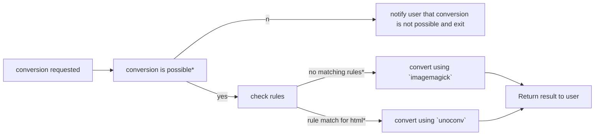

# Environment Variables Setup

This section gives an overview about the available environment variables that can
be set to configure the `conversion-service`.
Every variable in this collection here will be denoted if this variable is required or optional
with a note about what type of values are acceptable for the different variables.

>>>
Note that the special variables/rules mentioned below will influence the "natural" precedence order of the conversion service.
In order to avoid unforeseen circumstances you should read [this](#conversion-precedence-order)
>>>

## Variables

Below all possible variables are listed with a corresponding description, an indicator if this is a required variable and one or more example usages.

### Executable Paths

| Variable | Required | Description | Example |
| :--- | :---: | --- | --- |
| `FFMPEG_PATH` | X* | The path to the `ffmpeg` executable | `/opt/ffmpeg/bin` |
| `IMAGE_MAGICK_PATH` | X* | The path to the `imageMagick` executable | `/usr/bin/imagemagick` |
| `UNOCONV_PATH` | X* | The path to the `unoconv` executable | `/usr/bin/unoconv` |

### Conversion Options

| Variable | Required | Description | Example |
| :--- | :---: | --- | --- |
| `MAX_CONVERSION_TIME` | X | The maximum amount of time in `ms` that a conversion should last before aborting the process | 90000 (=> 90s) |
| `MAX_CONVERSION_TRIES` | X | An integer value representing the maximum tries the conversion-service will make use of if a conversion fails on first try. | 5 |
| `CONVERTER_DOCUMENT_PRIORITY` | X | The priority between all included conversion wrappers the conversion service can use. The left-most value has highest priority and all values should be comma-separated | ffmpeg,imageMagick, unoconv |
| `CONVERTER_MEDIA_PRIORITY` | X | The priority between all available conversion wrappers the service can make use of. Left-most value has highest priority and all provided values should be comma-separated. | imageMagick, ffmpeg, unoconv |

### Special Rules

| Variable | Required | Description | Example |
| :--- | :---: | --- | --- |
| `CONVERT_TO_<EXT>_WITH` | | A special rule for the conversion service to determine which conversion wrapper should be used for conversions to the specified format. The value should be the name of the conversion binary/wrapper. *This will influence the default conversion behavior of the service, also see [here](#the-mono-format-conversion-rule)* | `CONVERT_TO_PDF_WITH`=unoconv,<br/>`CONVERT_TO_MP4_WITH`=ffmpeg |
| `CONVERT_FROM_<I_EXT>_TO_<O_EXT>_WITH` || A special rule format for the conversion service to determine the conversion wrapper used for specified extensions. The value used here should be the name of the conversion binary/wrapper. *This will influence the default conversion behavior of the service, also see [here](#the-multi-format-conversion-rule)* |`CONVERT_FROM_JPG_TO_PDF_WITH`=imagemagick|

> The *-marked variables should **only** be changed when **not** using a docker setup, since the docker already includes the installations and the configuration will default to the install locations within the docker container.

### The Mono-format conversion rule

The `mono` format rule pattern looks like this:

```.env
CONVERT_TO_<EXT>_WITH=<value>
```

With this special rule it is possible to make a custom configuration for one (conversion) format, that specifies how the input will be converted when this rule matches. In short this means that all conversions of files with the `<EXT>` will be converted using the specified conversion wrapper.

### The Multi-format conversion rule

```.env
CONVERT_FROM_<I_EXT>_TO_<O_EXT>_WITH=<value>
```

This special rule allows to customize the conversion service behavior even more than with the `mono-format conversion rule`.
This rule specifies what wrapper/binary will be used for **all** conversions from the input format (`<I_EXT>`) to the specified target format (`<O_EXT>`)>

**Example**:

```.env
CONVERT_PNG_TO_PDF_WITH=imagemagick
```

The above given rule tells the conversion service to always convert `.png` to `.pdf` files using the `imagemagick` wrapper.

## Conversion precedence order

In general the precedence order for conversions can be described the following way:

1. If there is no rules to specify restrictions for the webservice then the order given from the `env`-variables will be used, meaning the left-most wrapper will be used to convert the file in first place. (In case of errors another wrapper will be used to avoid corrupted conversion results)
1. Mono-Format rule is specified: The order given from `.env` will be used, unless the `target-format` of the conversion matches with a rule. Then the wrapper specified in the matching rule will have highest priority for the current conversion
1. Multi-Format rule is specified: The order given from `.env` will be respected for the conversion unless there is <br/>1. A matching `Mono-Format` rule, then this will have higher priority **OR**<br/>2. A matching `Multi-Format` rule. The value specified with this rule will always have highest priority for conversions.

Saying this is the configuration for the webservice:

```bash
# normal priority rules
CONVERTER_DOCUMENT_PRIORITY=imagemagick,unoconv,ffmpeg
CONVERTER_MEDIA_PRIORITY=imagemagick,ffmpeg,unoconv
# mono-format rule for JPEGs
CONVERT_TO_JPEG_WITH_imagemagick
# multi-format rule for html to pdf conversions
CONVERT_FROM_HTML_TO_PDF_WITH=unoconv
```

and there are two input files for the conversion: (a) `about-file-conversions.html` and (b) `no-special-thing.txt`

Then this will result in the following decision chain within the webservice:



Some further notes about the graph:

- *"conversion is possible": this means that the conversion from the origin format to the specified target is a valid conversion request.
- *"no matching rules": there are no configured rules that match on the conversion request
- *"rule match for html": A matching rule was found for the input file. This rule also changes the precedence order of the wrappers to use, since it is a `multi-format rule`.
